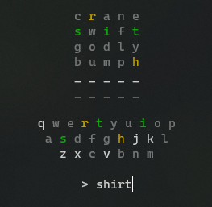

# Pyordle

Pyordle is a native python clone of the popular game Wordle. It is a command line game that can be played in the terminal, without installing any dependencies.

This is a practice exercise in OOP and python. It is not meant to be a perfect clone of the game, but rather a fun project to work on.

## Requirements

- Internet (for word checking and new word generation)

## Usage

`python3 pyordle.py`